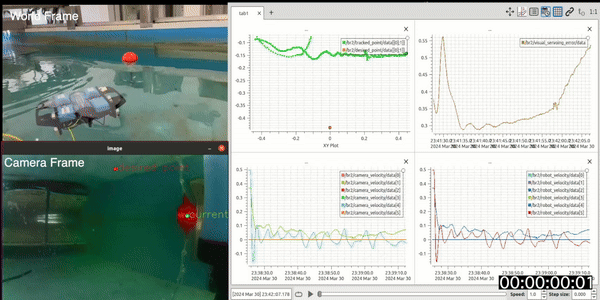
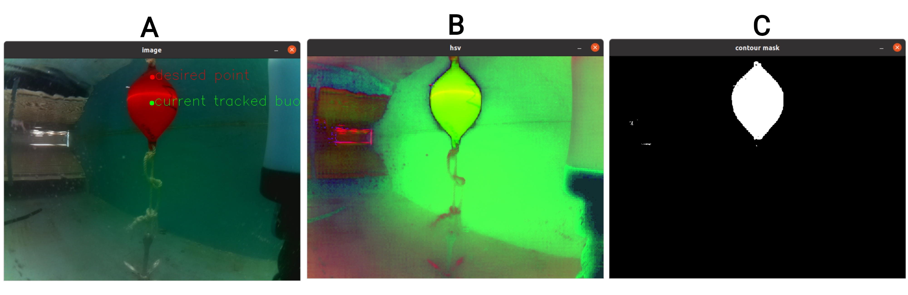
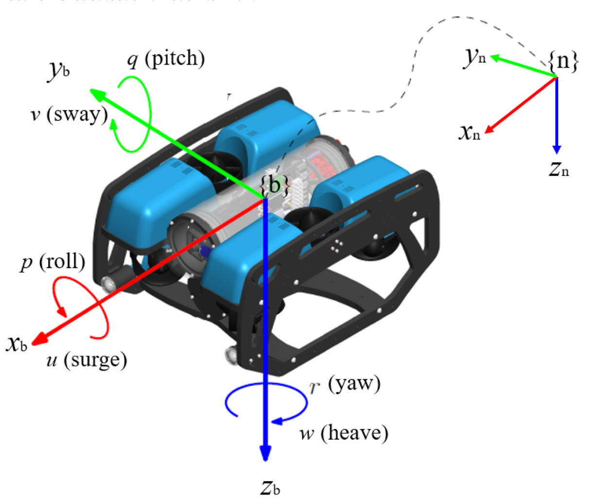
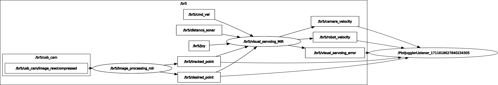
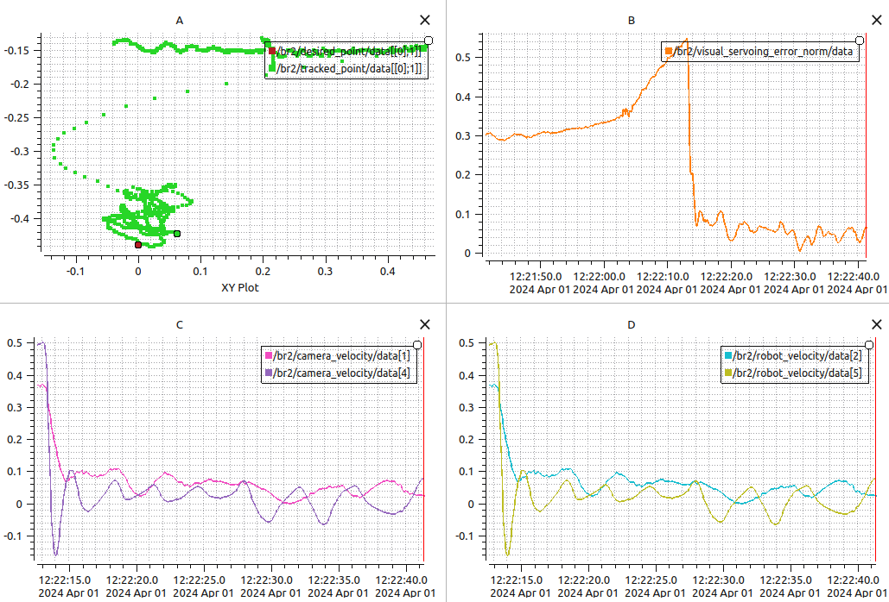
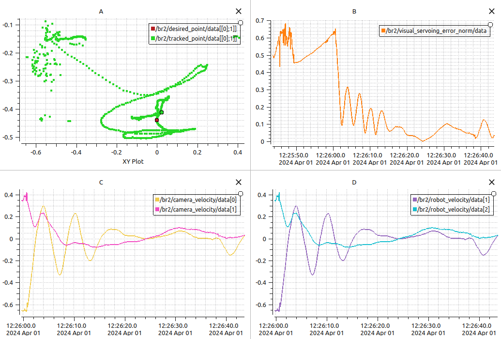
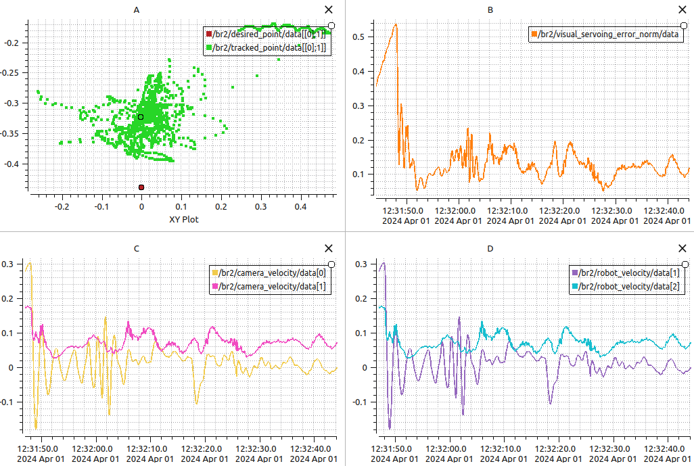

<h1 align="center">Image-Based Visual Servoing Control (IBVS)</h1>

<div align="center">

</div>
 
### Objective:
The objective is to implement visual servoing using OpenCV by detecting an orange buoy within an underwater environment. Subsequently, we aim to implement a Proportional (P) controller using an interaction matrix to regulate various degrees of freedom of a BlueROV. Initially, the controller focuses on regulating yaw-heave, and then sway-heave. Ultimately, the controller aims to oversee all five degrees of motion, except for pitch.

Group Members:

* [Madhushree Sannigrahi](https://github.com/Madhushree2000)
* [Abhimanyu Bhowmik](https://github.com/abhimanyubhowmik)
* [Chashnikov Sergei](https://www.linkedin.com/in/schashni/)
* [Tayyab Tahir](https://www.linkedin.com/in/tayyab-tahir-99ab74162/)
* [Bhat Ishfaq](https://www.linkedin.com/in/bhat-ishfaq/)

### How to Use:

* Prequisites:

    Linux 20.04 or 18.04 LTS

    ROS: Melodic for ubuntu 18.04, Neotic for 20.04

    Installation of mavros locally. 

    It also possible to install mavros packages from the network but some code may not be compatible any more with the embbedded version.


* Cloning the Project Repository : 
```git@github.com:abhimanyubhowmik/Visual_Servoing.git```

```
sudo apt-get install ros-melodic-joy

cd bluerov_ws
catkin build
catkin build -j1 -v

# Image processing

source devel/setup.bash
roslaunch autonomous_rov run_image_processing.launch

# Visual servoing 

source devel/setup.bash
roslaunch autonomous_rov run_visual_servoing.launch
```


### Feature Detection and Tracking

The input camera image is converted into HSV (Hue,
Saturation, Value) colour space using `cv2.cvtColor()`. The resultant image can be seen in Figure
1(B) 

<div align="center">

<p>Figure 1: (A) RGB Image with track point and desired point overlay; (B) Image in HSV format;
(C) Contour mask for the buoy</p>
</div>

After converting to HSV, a colour mask is applied to isolate the buoy's colour (assumed to be red/orange).

The `cv2.inRange()` function creates a binary mask where pixels within the specified HSV range(all orange pixels) are set to white(255), and others are set to zero (black). Considering our camera configurations, we took the lower range of red colour in HSV as $(0,50,50)$ and the upper range as $(10,255,255)$.  Contours are then detected in the binary mask using `cv2.findContours()`.Contours are simply the boundaries of white regions in the binary image. 

Finally, the centroid of the largest contour is computed to determine the buoy's current position in the image.The code identifies the largest contour in the binary mask, which is assumed to correspond to the buoy.
The centroid (centre of mass) of this contour is computed using the moments of the contour `cv2.moments()`.
The centroid coordinates ($cX, cY$) represent the current position of the buoy in pixel coordinates.


### Interaction Matrix Computation

The interaction matrix (L) is the relation between the camera motion and the change in the observed feature point in the image plane. In simple words, it is the Jacobian between the current and desired
position. For this project, we performed one feature point tracking, so the dimensionality would be 2x6.

$$
L_e^* = \begin{bmatrix}
 -1 & 0 & cX & cXcY & -(1+cX^2) & cY \\
0 & -1 & cY & 1+cY^2 & -cXcY & -cX   
\end{bmatrix}
$$

Here, $L_e^*$ is the interaction matrix for the actual point where ($cX, cY$) is the centroid coordinates of the buoy and $Z = 1$. 

$$
L_e = \begin{bmatrix}
 -1 & 0 & X_d & X_dY_d & -(1+X_d^2) & Y_d \\
0 & -1 & Y_d & 1+Y_d^2 & -X_dY_d & -X_d 
\end{bmatrix}
$$

Here, $L_e$ is the interaction matrix for the desired point where, $X_d = img width/2$, $Y_d = img height/2 -200$\\ and $Z = 1$. 

We subtract $200$ from $Y_d$ to project the desired point at the upper side of the image frame rather than at the centre as in most cases, the buoy is near to the surface of the water and with a desired point at the centre, the BlueROV tries to "jump out" of the water.


 All the 3 above-discussed methods in section 2 to predict the interaction matrix are implemented here. However, we got the best results with the 3rd option,i.e., $L_{\text{est}}^+ = \frac{1}{2}(L_e + L_e^*)^+\ $.


### Proportional Controller

$u(t) = \lambda \cdot e(t) $

Where:
- $ u(t) $ is the control signal at time $t$,
- $ e(t) $ is the error between the desired setpoint and the current state at time $t$, and
- $\lambda$ is the proportional gain, which determines the sensitivity of the controller's response to changes in the error.

<div align="center">

<p>Figure 2: Degrees of Freedom of a BlueROV</p>
</div>


### Frame Transformation

The computed velocities have to be converted to the body frame from the camera frame with the first frame as the camera frame, in order to get a meaningful and accurate control action. To achieve this, we apply a transformation matrix.

$$
\text{Transformation matrix} = \begin{pmatrix}
R & \text{skew pos} \cdot R \\
\mathbf{0}_{3 \times 3} & R
\end{pmatrix}
$$

where $R$ is the Rotation matrix and $(skew pos)$ is the skew matrix of the position vector (position of the camera in the robot frame).

$$
R = \begin{pmatrix}
0 & 0 & 1.0 \\
1.0 & 0 & 0 \\
0 & 1.0 & 0
\end{pmatrix}
$$

$$
\text{{skew pos}} = \begin{pmatrix}
0 & 0 & 0 \\
0 & 0 & -0.159 \\
0 & 0.159 & 0
\end{pmatrix}
$$


### Results and Discussion

<div align="center">

<p>Figure 3: ROS Node structures</p>
</div>

### Yaw-Heave Control
After testing the image processing on bag files, we tested the controller on the real tank. We tested for yaw and heave with a lambda($\lambda$) value of 2. The figure 4 consists of 4 graphs. Graph (A) portrays the desired point in red and the actual point in green along with the trajectory of the actual point. Graph (B) plots the Euclidian norm of error. We can clearly see that after the initialization of the control in the BlueROV, the error decreased drastically and the actual point came very close to the desired point. The "hills" or oscillations observed are mainly due to the moving of the buoy to test the controller. It also depicts the inherent oscillations of a P controller around the desired points. 

<div align="center">

<p>Figure 4: Yaw-Heave Control</p>
</div>

Graphs (C) and (D) show the camera velocity and robot velocity respectively. The publishing of these topics starts after the controller is initialised in the ROV. Thus, the plot starts at a different time frame than the rest. In Graph(C), $data[1]$ and $data[4]$ show the y-axis and rotation along the y-axis of the camera respectively. This is the heave ($data[5]$) and yaw motion ($data25]$) for the body as seen in Graph (D).

### Sway-Heave Control

Figure 5 consists of 4 graphs for sway and heave with a lambda($\lambda$) value of 1.2. Just like the yaw and heave controller, we observe an immediate drop in error as the controller kicks in. Graph (A) shows the trajectory of the actual point with respect to the desired point in the camera frame. Since we are controlling the sway and not any angular movement like yaw, the trajectory is mostly linear, especially when compared to the yaw-heave control. Due to the high linear momentum, we encounter large oscillations in the x-axis of the camera frame during initial stabilisation.

<div align="center">

<p>Figure 5: Sway-Heave Control</p>
</div>

Graph (B) is the L2-norm of the error. Here, we observe that after initial oscillations, the error converges to almost zero. To check the robustness of the controller, we moved the buoy externally, resulting in the subsequent error "bumps" in the graph. Graphs (C) and (D) illustrate the x and y velocities of the camera frame and the y and z velocities of the robot frame resulting in sway and heave.

### 5-degrees of Freedom Control

<div align="center">

<p>Figure 6: 5 DOF Control</p>
</div>

Figure 6 demonstrates the graphs for the 5-degree controller with a lambda($\lambda$) value of 1.5. Here we control all the degrees of freedom, except the pitch. We don't use pitch for the controller as the ROV can turn upside down to match the desired point, which is not what we intend to do. Graph (A) provides us with the trajectory of the desired point in the XY plane. We observed a constant offset in the heave here. This may be happening because the P-controller is not sufficient to take care of all 5 degrees of freedom. The L2-norm of errors in Graph (B) also confirms the error of $\leq0.1m$ . The jitters observed were mainly due to the struggling P-controller. We were also trying to move the buoy to different positions to check the ROV robustness, thus resulting in steep "hills". Graph (C) and (D) portrays the camera and ROV velocity in all directions except the pitch. 


